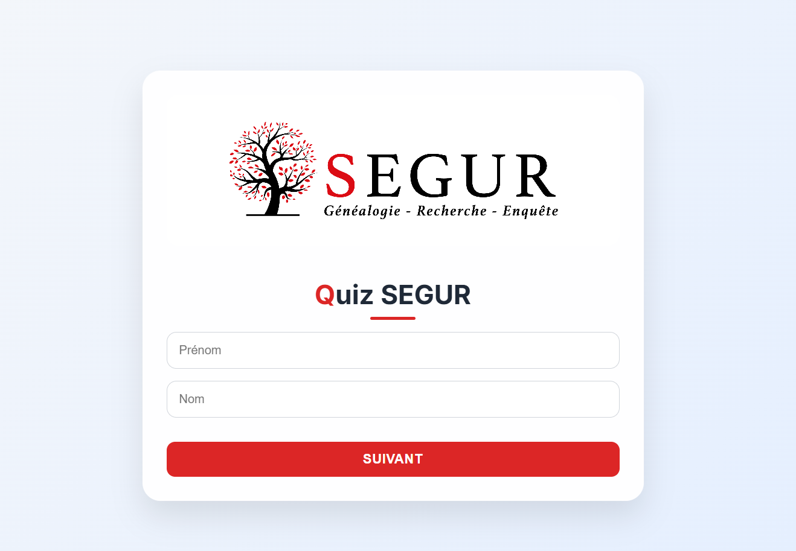
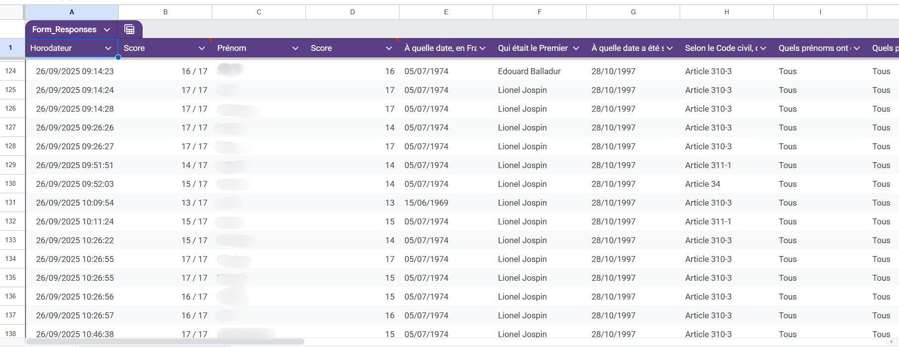
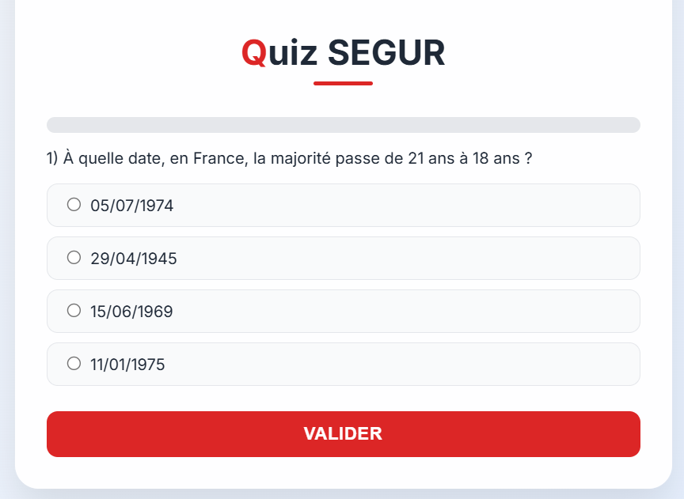
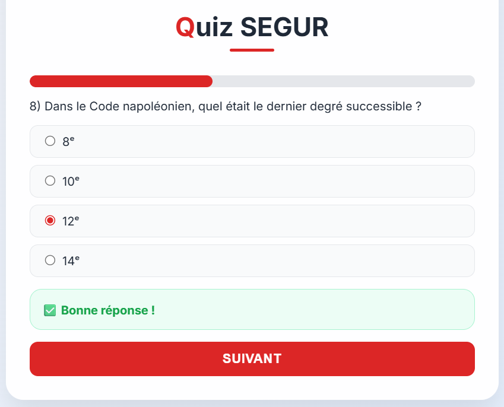
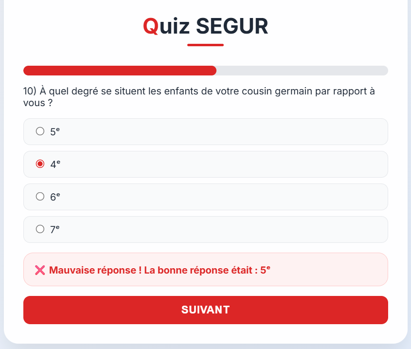
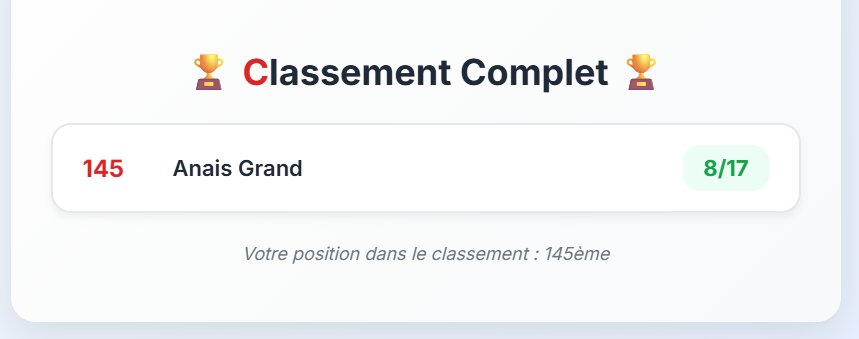
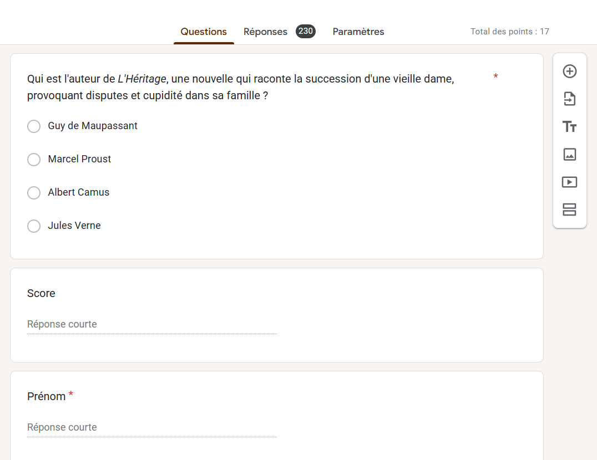

<h1 align="center">🧠 Quiz interactif sur le droit français</h1>

  <i>Conçu pour un congrès notarial</i>

## 🎯 Objectif
Quiz interactif sur le droit français (majorité, PACS, héritage...) avec leaderboard et intégration Google Forms couplé à un Google Sheets.

  

## 🧩 Fonctionnement
Au départ, j’ai créé toutes les questions dans Google Forms afin de pouvoir récupérer facilement les scores via Google Sheets.  
L’objectif : éviter une base de données tout en affichant le classement en temps réel.

  

## 💻 Interface
Comme je voulais un rendu plus joli et en accord avec la direction artistique de l'étude, j’ai ensuite refait toute l’interface du quiz en HTML, CSS et JavaScript.

  

Le quiz comporte 17 questions.

✅ Une bonne réponse ajoute 1 point.

  

❌ En cas de mauvaise réponse, la correction s’affiche immédiatement.

  

## 🏆 Résultats
À la fin, chaque participant peut voir :

- Son score total
- Son classement parmi tous les participants

  

## 📊 Données et leaderboard

De mon côté, j’utilise Google Sheets comme une base de données en temps réel, ce qui me permet de suivre instantanément les résultats de tous les participants.

  

## 🛠️ Technologies utilisées

- HTML / CSS / JavaScript pour le front-end
- Google Forms pour la création et la collecte des réponses
- Google Sheets pour le stockage et le suivi en temps réel
